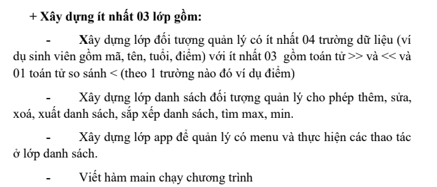
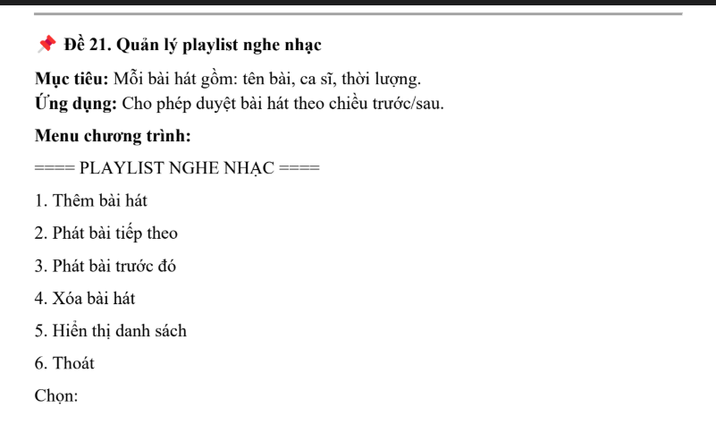

# DSA_Project_Assignment

## Giảng viên hướng dẫn

- **Thầy:** Nguyễn Việt Hưng

## Nhóm thực hiện

| Thành viên       | MSV       |
| ---------------- | --------- |
| Trần Trường Thọ  | 241230855 |
| Nguyễn Minh Khuê | 231230815 |

---

## Tổng quan

**Bài tập lớn DSA (Data Structures & Algorithms Project Assignment)** gồm hai phần chính:

- **Phần A:** Quản lý bãi đỗ xe ô tô
- **Phần B:** Quản lý playlist nghe nhạc

Bài tập nhằm mục tiêu áp dụng kiến thức về **cấu trúc dữ liệu (List, Doubly Linked List)** và **thuật toán cơ bản** để quản lý dữ liệu theo các thao tác: **thêm, xóa, sửa, tìm kiếm, sắp xếp**, và xuất ra màn hình hoặc file.

---

## Phần A — Quản lý bãi đỗ xe

### 0. Yêu cầu

### 1. Mục tiêu

Xây dựng chương trình giúp quản lý một bãi đỗ xe thông thường với các yêu cầu: **thêm, xóa, cập nhật thông tin xe, tìm kiếm theo biển số hoặc hãng, sắp xếp theo giờ gửi, tính số lượng xe, tính tiền gửi và lưu trữ dữ liệu**. Chương trình sử dụng **thư viện STL** có sẵn để quản lý danh sách xe.

### 2. Chức năng dự kiến

- Hiển thị danh sách xe hiện có
- Thêm xe mới vào bãi
- Xóa xe rời bãi
- Cập nhật thông tin xe
- Tìm xe theo biển số
- Tìm xe theo hãng
- Sắp xếp xe theo giờ gửi (tăng dần, giảm dần)
- Tìm xe có giờ gửi sớm nhất và muộn nhất
- Đếm số xe hiện có trong bãi
- Tính giá tiền gửi xe theo thời gian gửi
- Lưu dữ liệu vào file
- Thoát chương trình

### 3. Cấu trúc dữ liệu sử dụng: **STL List**

- **Class Car:** Quản lý thông tin một xe, gồm các trường:

  - Biển số xe
  - Chủ xe
  - Hãng xe
  - Giờ gửi
  - Tiền gửi
  - Các phương thức: nhập, xuất, tính tiền, so sánh...

- **Class Parking:** Quản lý danh sách xe (`List<Car>`) và các hàm thao tác: thêm, sửa, xóa, tìm kiếm, sắp xếp, xuất danh sách...

- **Class App:** Quản lý menu chính và gọi các thao tác từ lớp Parking.

### 4. Giải thích tại sao dùng List thay vì Vector

- **List (Danh sách liên kết):**

  - Thêm/xóa phần tử ở giữa hoặc đầu/cuối nhanh (O(1) nếu có iterator), không tốn công dịch chuyển.
  - Linh hoạt với số lượng phần tử thay đổi liên tục.

- **Vector (Mảng động):**

  - Thêm/xóa phần tử ở cuối nhanh, nhưng thêm/xóa ở giữa tốn O(n) do phải dịch chuyển dữ liệu.

- **Kết luận:** Vì bãi xe thường xuyên thêm/xóa xe ở giữa hoặc đầu, nên **List** là lựa chọn tối ưu hơn Vector.

---

## Phần B — Quản lý playlist nghe nhạc

### 0. Yêu cầu

### 1. Mục tiêu

Xây dựng chương trình quản lý danh sách phát nhạc, cho phép: **thêm, xóa, duyệt theo chiều trước/sau và phát bài hát**. Tự xây dựng lại **cấu trúc danh sách liên kết đôi** và có menu giống như yêu cầu.

### 2. Chức năng dự kiến

- Thêm bài hát mới vào danh sách
- Xóa bài hát khỏi danh sách
- Phát bài hát tiếp theo
- Quay lại bài trước
- Hiển thị toàn bộ danh sách bài hát
- Thoát

### 3. Cấu trúc dữ liệu sử dụng: **Doubly Linked List**

- **Class Song:** Lưu thông tin: tên bài hát, ca sĩ, thời lượng.
- **Class Playlist:** Quản lý danh sách các bài hát và các chức năng của playlist.

---
